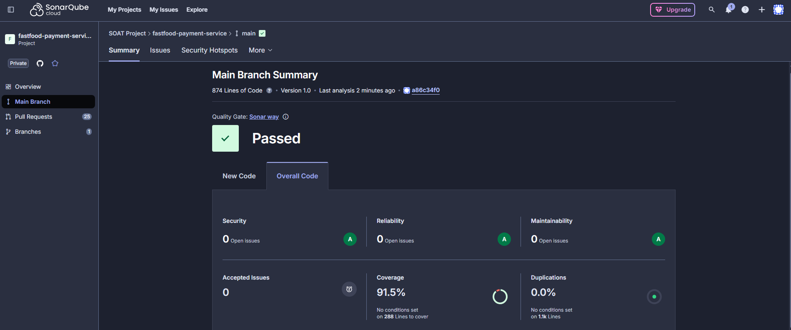
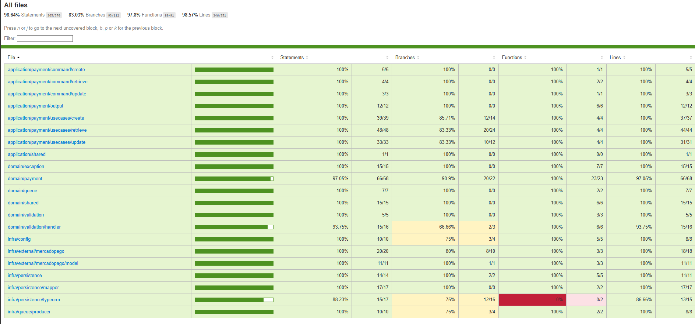

<div align="center">
    <h1>🍔 Fastfood Payment Service</h1>
    <p>Serviço de pagamentos do sistema Fastfood</p>
    <p>
        
        
        
        
        
        
        
    </p>
</div>

---

🚀 <b>Stack:</b> NestJS, PostgreSQL, MercadoPago, AWS SQS, Docker, Kubernetes, Terraform

---

## ✨ Funcionalidades

- 🔗 API REST para operações de pagamento
- 💸 Integração com MercadoPago
- 📩 Processamento assíncrono via AWS SQS
- ❤️ Health check para readiness/liveness
- 🚢 Suporte a CI/CD, deploy em Kubernetes/EKS

## ⚙️ Instalação e Build

```bash
npm install
npm run build
```

## ▶️ Execução Local

```bash
npm run start:dev
```

## 🧪 Testes

```bash
npm run test
npm run test:cov
```

## 🐳 Docker

Build da imagem:

```bash
docker build -t soatproject/fastfood-payment-service:latest .
```

Rodar localmente:

```bash
docker run -p 8080:8080 --env-file .env soatproject/fastfood-payment-service:latest
```

## ☸️ Deploy Kubernetes

- Os manifests estão em `infra/kubernetes/`
- O serviço é exposto via Gateway/Ingress no path `/payments`
- Health check: `/payments/health`

Exemplo de apply:

```bash
kubectl apply -f infra/kubernetes/
```

## 🏗️ Deploy Terraform

- Infraestrutura como código em `infra/terraform/`
- Provisionamento de EKS, banco, secrets/configmaps

```bash
cd infra/terraform
terraform init
terraform plan -var-file="./environment/dev/terraform.tfvars"
terraform apply
```

## 💚 Health Check

- Readiness/Liveness: `GET /payments/health`
- Atende também: `/payments/health/readiness` e `/payments/health/liveness`

## ⚙️ Variáveis de Ambiente

Configuração via ConfigMap e Secret no Kubernetes. Veja exemplos em `infra/kubernetes/configmap.yaml` e `infra/kubernetes/deployment.yaml`.

## 📊 Sonar Scan Resultado



## 🔔 Integração AWS SQS

<details>
<summary><b>📥 Fila: <code>fastfood-soat-terraform-order-to-payment.fifo</code></b></summary>

<br/>
<b>Consumidor:</b> Recebe eventos de pedido para criar pagamentos.<br/>
<b>Corpo recebido:</b>

```json
{
    "eventType": "ORDER_CREATED",
    "orderId": "string",
    "customerId": "string",
    "totalAmount": 100.0,
    "items": [{ "productId": "string", "quantity": 2, "price": 50.0 }],
    "createdAt": "2024-01-01T12:00:00Z"
}
```

</details>

<details>
<summary><b>📤 Fila: <code>fastfood-soat-terraform-payment-to-order.fifo</code></b></summary>

<br/>
<b>Produtor:</b> Envia eventos de pagamento realizado para o serviço de pedidos.<br/>
<b>Corpo enviado:</b>

```json
{
    "orderId": "string",
    "paidAt": "2024-01-01T12:05:00Z",
    "amount": 100.0
}
```

</details>

## 🧩 Testes BDD

Os testes BDD estão em <code>src/test/bdd</code> e cobrem:

- ✅ Criação de pagamento
- 🔍 Consulta de status do pagamento
- 📲 Consulta de QR code do pagamento
- 🔄 Atualização de status do pagamento

Cada caso possui cenários de sucesso e falha, descritos em arquivos <code>.feature</code> e implementados em <code>.bdd.spec.ts</code> usando <b>jest-cucumber</b>.

## 🛡️ Cobertura de Testes

<p align="center">
    
</p>
